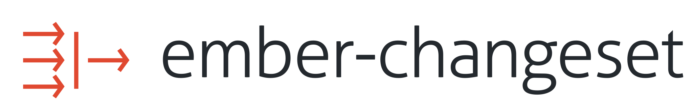

<h1 align="center"><br><br><a href="https://github.com/elixir-lang/ecto"></a><br><br><br></h1>

<a href="https://badge.fury.io/js/ember-changeset"></a>
<a href="https://github.com/poteto/ember-changeset/actions/workflows/ci.yml?query=branch%3Amaster"></a>
<a href="https://badge.fury.io/js/ember-changeset"></a>
<a href="https://emberobserver.com/addons/ember-changeset"></a>

```
ember install ember-changeset
```

> [Watch a free video intro presented by EmberScreencasts](https://www.emberscreencasts.com/posts/168-introduction-to-ember-changeset)
>
>  

## Updates

We have released `v3.0.0`. See the CHANGELOG [here](https://github.com/poteto/ember-changeset/blob/master/CHANGELOG.md). This requires Ember >= 3.13 as the use of `@tracked` will help us monitor and propagate changes to the UI layer. If your app is < 3.13 or you need to support IE11, then you can install the 2.0 series `ember install ember-changeset@v2.2.4`.

Support for IE11 was dropped with the `v3.0.0` release given our ubiquitous use of Proxy.

The base library for this addon is [validated-changeset](https://github.com/validated-changeset/validated-changeset/). As a result, this functionality is available outside of Ember as well!

## Philosophy

The idea behind a changeset is simple: it represents a set of valid changes to be applied onto any Object (`Ember.Object`, `DS.Model`, POJOs, etc). Each change is tested against an optional validation, and if valid, the change is stored and applied when executed.

Assuming a Data Down, Actions Up (DDAU) approach, a changeset is more appropriate compared to implicit 2 way bindings. Other validation libraries only validate a property _after_ it is set on an Object, which means that your Object can enter an invalid state.

`ember-changeset` only allows valid changes to be set, so your Objects will never become invalid (assuming you have 100% validation coverage). Additionally, this addon is designed to be un-opinionated about your choice of form and/or validation library, so you can easily integrate it into an existing solution.

The simplest way to incorporate validations is to use [`ember-changeset-validations`](https://github.com/poteto/ember-changeset-validations/), a companion addon to this one. It has a simple mental model, and there are no Observers or CPs involved – just pure functions.

See also the [plugins](#plugins) section for addons that extend `ember-changeset`.

#### tl;dr

```js
import { Changeset } from 'ember-changeset';

let dummyValidations = {
  firstName(newValue) {
    return !!newValue;
  },
};

function validatorFn({ key, newValue, oldValue, changes, content }) {
  let validator = get(dummyValidations, key);

  if (typeof validator === 'function') {
    return validator(newValue, oldValue, changes, content);
  }
}

let changeset = Changeset(user, validatorFn);
user.get('firstName'); // "Michael"
user.get('lastName'); // "Bolton"

changeset.set('firstName', 'Jim');
changeset.set('lastName', 'B');
changeset.get('isInvalid'); // true
changeset.get('errors'); // [{ key: 'lastName', validation: 'too short', value: 'B' }]
changeset.set('lastName', 'Bob');
changeset.get('isValid'); // true

user.get('firstName'); // "Michael"
user.get('lastName'); // "Bolton"

changeset.save(); // sets and saves valid changes on the user
user.get('firstName'); // "Jim"
user.get('lastName'); // "Bob"
```

## Usage

First, create a new `Changeset` using the `changeset` helper or through JavaScript via a factory function:

```hbs
{{! application/template.hbs}}
{{#with (changeset model this.validate) as |changesetObj|}}
  <DummyForm
      @changeset={{changesetObj}}
      @submit={{this.submit}}
      @rollback={{this.rollback}} />
{{/with}}
```

```js
import Component from '@ember/component';
import { Changeset } from 'ember-changeset';

export default FormComponent extends Component {
  init(...args) {
    super.init(...args)

    let validator = this.validate;
    this.changeset = Changeset(this.model, validator);
  }
}
```

The helper receives any Object (including `DS.Model`, `Ember.Object`, or even POJOs) and an optional `validator` action. If a `validator` is passed into the helper, the changeset will attempt to call that function when a value changes.

```js
// application/controller.js
import Controller from '@ember/controller';
import { action } from '@ember/object';

export default class FormController extends Controller {
  @action
  submit(changeset) {
    return changeset.save();
  }

  @action
  rollback(changeset) {
    return changeset.rollback();
  }

  @action
  validate({ key, newValue, oldValue, changes, content }) {
    // lookup a validator function on your favorite validation library
    // and return a Boolean
  }
}
```

Then, in your favorite form library, simply pass in the `changeset` in place of the original model.

```hbs
{{! dummy-form/template.hbs}}
<form>
  <Input @value={{changeset.firstName}} />
  <Input @value={{changeset.lastName}} />

  <button {{on "click" this.submit changeset}}>Submit</button>
  <button {{on "click" this.rollback changeset}}>Cancel</button>
</form>
```

In the above example, when the input changes, only the changeset's internal values are updated. When the submit button is clicked, the changes are only executed if _all changes_ are valid.

On rollback, all changes are dropped and the underlying Object is left untouched.

## Extending the base ember-changeset class

```js
import { EmberChangeset, Changeset } from 'ember-changeset';

class MyChangeset extends EmberChangeset {
  save() {
    super.save(...arguments);
    // do stuff
  }
}

let changeset = Changeset(user, validatorFn, validationMap, { changeset: MyChangeset });
```

## Changeset template helpers

`ember-changeset` overrides `set` and `get` in order to handle deeply nested setters. `mut` is simply an alias for `Ember.set(changeset, ...)`, thus we provide a `changeset-set` template helper if you are dealing with nested setters.

`changeset-get` is necessary for nested getters to easily retrieve leaf keys without error. Ember's templating layer will ask us for the first key it comes across as it traverses down the object (`user.firstName`). We keep track of the changes, but to also keep track of unchanged values and properly merge them in the changeset is difficult. If you are only accessing keys in an object that is only one level deep, you do not need this helper.

```hbs
<form>
  <input
    id="first-name"
    type="text"
    value={{changeset-get changeset "person.firstName"}}
    {{on "change" (fn this.updateFirstName changeset)}}>
</form>
```

## Limiting which keys dirty the changeset

In order to limit the changes made to your changeset and it's associated `isDirty` state, you can pass in a list of `changesetKeys`.

```js
let changeset = Changeset(model, validatorFn, validationMap, { changesetKeys: ['name'] });
```

## Disabling Automatic Validation

The default behavior of `Changeset` is to automatically validate a field when it is set. Automatic validation can be disabled by passing `skipValidate` as an option when creating a changeset.

```js
let changeset = Changeset(model, validatorFn, validationMap, { skipValidate: true });
```

```hbs
{{#with (changeset model this.validate skipValidate=true) as |changesetObj|}}
  ...
{{/with}}
```

Be sure to call `validate()` on the `changeset` before saving or committing changes.

## Types

```ts
import Component from '@glimmer/component';
import { BufferedChangeset } from 'ember-changeset/types';
import { Changeset } from 'ember-changeset';

interface Args {
  user: {
    name: string;
    age: number;
  };
}

export default class Foo extends Component<Args> {
  changeset: BufferedChangeset;

  constructor(owner, args) {
    super(owner, args);
    this.changeset = Changeset(args.user);
  }
}
```

Other available types include the following. Please put in a PR if you need more types or access directly in `validated-changeset`!

```js
import { ValidationResult, ValidatorMapFunc, ValidatorAction } from 'ember-changeset/types';
```

## Alternative Changeset

Enabled in 4.1.0

We now ship a ValidatedChangeset that is a proposed new API we would like to introduce and see if it jives with users. The goal of this new feature is to remove confusing APIs and externalize validations.

- ✂️ `save`
- ✂️ `cast`
- ✂️ `merge`
- `errors` are required to be added to the Changeset manually after `validate`
- `validate` takes a callback with the sum of changes.  In user land you will call `changeset.validate((changes) => yupSchema.validate(changes))`

```js
import Component from '@glimmer/component';
import { ValidatedChangeset } from 'ember-changeset';
import { action, get } from '@ember/object';
import { object, string } from 'yup';

class Foo {
  user = {
    name: 'someone',
    email: 'something@gmail.com',
  };
}

const FormSchema = object({
  cid: string().required(),
  user: object({
    name: string().required(),
    email: string().email(),
  })
});

export default class ValidatedForm extends Component {
  constructor() {
    super(...arguments);

    this.model = new Foo();
    this.changeset = ValidatedChangeset(this.model);
  }

  @action
  async setChangesetProperty(path, evt) {
    this.changeset.set(path, evt.target.value);
    try {
      await this.changeset.validate((changes) => FormSchema.validate(changes));
      this.changeset.removeError(path);
      await this.model.save();
    } catch (e) {
      this.changeset.addError(e.path, { value: this.changeset.get(e.path), validation: e.message });
    }
  }

  @action
  async submitForm(changeset, event) {
    event.preventDefault();

    changeset.execute();
  }
}
```

## API

- Properties
  - [`error`](#error)
  - [`change`](#change)
  - [`errors`](#errors)
  - [`changes`](#changes)
  - [`data`](#data)
  - [`pendingData`](#pendingData)
  - [`isValid`](#isvalid)
  - [`isInvalid`](#isinvalid)
  - [`isPristine`](#ispristine)
  - [`isDirty`](#isdirty)
- Methods
  - [`get`](#get)
  - [`set`](#set)
  - [`prepare`](#prepare)
  - [`execute`](#execute)
  - [`unexecute`](#unexecute)
  - [`save`](#save)
  - [`merge`](#merge)
  - [`rollback`](#rollback)
  - [`rollbackInvalid`](#rollbackinvalid)
  - [`rollbackProperty`](#rollbackproperty)
  - [`validate`](#validate)
  - [`addError`](#adderror)
  - [`pushErrors`](#pusherrors)
  - [`snapshot`](#snapshot)
  - [`restore`](#restore)
  - [`cast`](#cast)
  - [`isValidating`](#isvalidating)
- Events
  - [`beforeValidation`](#beforevalidation)
  - [`afterValidation`](#aftervalidation)
  - [`afterRollback`](#afterrollback)

#### `error`

Returns the error object.

```js
{
  firstName: {
    value: 'Jim',
    validation: 'First name must be greater than 7 characters'
  }
}
```

Note that keys can be arbitrarily nested:

```js
{
  address: {
    zipCode: {
      value: '123',
      validation: 'Zip code must have 5 digits'
    }
  }
}
```

You can use this property to locate a single error:

```hbs
{{#if changeset.error.firstName}}
  <p>{{changeset.error.firstName.validation}}</p>
{{/if}}

{{#if changeset.error.address.zipCode}}
  <p>{{changeset.error.address.zipCode.validation}}</p>
{{/if}}
```

**[⬆️ back to top](#api)**

#### `change`

Returns the change object.

```js
{
  firstName: 'Jim';
}
```

Note that keys can be arbitrarily nested:

```js
{
  address: {
    zipCode: '10001';
  }
}
```

You can use this property to locate a single change:

```hbs
{{changeset.change.firstName}}
{{changeset.change.address.zipCode}}
```

**[⬆️ back to top](#api)**

#### `errors`

Returns an array of errors. If your `validate` function returns a non-boolean value, it is added here as the `validation` property.

```js
[
  {
    key: 'firstName',
    value: 'Jim',
    validation: 'First name must be greater than 7 characters',
  },
  {
    key: 'address.zipCode',
    value: '123',
    validation: 'Zip code must have 5 digits',
  },
];
```

You can use this property to render a list of errors:

```hbs
{{#if changeset.isInvalid}}
  <p>There were errors in your form:</p>
  <ul>
    {{#each changeset.errors as |error|}}
      <li>{{error.key}}: {{error.validation}}</li>
    {{/each}}
  </ul>
{{/if}}
```

**[⬆️ back to top](#api)**

#### `changes`

Returns an array of changes to be executed. Only valid changes will be stored on this property.

```js
[
  {
    key: 'firstName',
    value: 'Jim',
  },
  {
    key: 'address.zipCode',
    value: 10001,
  },
];
```

You can use this property to render a list of changes:

```hbs
<ul>
  {{#each changeset.changes as |change|}}
    <li>{{change.key}}: {{change.value}}</li>
  {{/each}}
</ul>
```

**[⬆️ back to top](#api)**

#### `data`

Returns the Object that was wrapped in the changeset.

```js
let user = { name: 'Bobby', age: 21, address: { zipCode: '10001' } };
let changeset = Changeset(user);

changeset.get('data'); // user
```

**[⬆️ back to top](#api)**

#### `pendingData`

Returns object with changes applied to original data without mutating original data object.
Unlike `execute()`, `pendingData` shows resulting object even if validation failed. Original data or changeset won't be modified.

Note: Currently, it only works with POJOs. Refer to [`execute`](#execute) for a way to apply changes onto ember-data models.

```js
let user = { name: 'Bobby', age: 21, address: { zipCode: '10001' } };
let changeset = Changeset(user);

changeset.set('name', 'Zoe');

changeset.get('pendingData'); // { name: 'Zoe', age: 21, address: { zipCode: '10001' } }
```

**[⬆️ back to top](#api)**

#### `isValid`

Returns a Boolean value of the changeset's validity.

```js
changeset.get('isValid'); // true
```

You can use this property in the template:

```hbs
{{#if changeset.isValid}}
  <p>Good job!</p>
{{/if}}
```

**[⬆️ back to top](#api)**

#### `isInvalid`

Returns a Boolean value of the changeset's (in)validity.

```js
changeset.get('isInvalid'); // true
```

You can use this property in the template:

```hbs
{{#if changeset.isInvalid}}
  <p>There were one or more errors in your form</p>
{{/if}}
```

**[⬆️ back to top](#api)**

#### `isPristine`

Returns a Boolean value of the changeset's state. A pristine changeset is one with no changes.

```js
changeset.get('isPristine'); // true
```

If changes present on the changeset are equal to the content's, this will return `true`. However, note that key/value pairs in the list of changes must all be present and equal on the content, but not necessarily vice versa:

```js
let user = { name: 'Bobby', age: 21, address: { zipCode: '10001' } };

changeset.set('name', 'Bobby');
changeset.get('isPristine'); // true

changeset.set('address.zipCode', '10001');
changeset.get('isPristine'); // true

changeset.set('foo', 'bar');
changeset.get('isPristine'); // false
```

**[⬆️ back to top](#api)**

#### `isDirty`

Returns a Boolean value of the changeset's state. A dirty changeset is one with changes.

```js
changeset.get('isDirty'); // true
```

**[⬆️ back to top](#api)**

#### `get`

Exactly the same semantics as `Ember.get`. This proxies first to the error value, the changed value, and finally to the underlying Object.

```js
changeset.get('firstName'); // "Jim"
changeset.set('firstName', 'Billy'); // "Billy"
changeset.get('firstName'); // "Billy"

changeset.get('address.zipCode'); // "10001"
changeset.set('address.zipCode', '94016'); // "94016"
changeset.get('address.zipCode'); // "94016"
```

You can use and bind this property in the template:

```hbs
{{input value=changeset.firstName}}
```

Note that using `Ember.get` **will not necessarily work if you're expecting an Object**. On the other hand, using `changeset.get` will work just fine:

```js
get(changeset, 'momentObj').format('dddd'); // will error, format is undefined
changeset.get('momentObj').format('dddd'); // => "Friday"
```

This is because `Changeset` wraps an Object with `Ember.ObjectProxy` internally, and overrides `Ember.Object.get` to hide this implementation detail.

Because an Object is wrapped with `Ember.ObjectProxy`, the following (although more verbose) will also work:

```js
get(changeset, 'momentObj.content').format('dddd'); // => "Friday"
```

**[⬆️ back to top](#api)**

#### `set`

Exactly the same semantics as `Ember.set`. This stores the change on the changeset. It is recommended to use `changeset.set(...)` instead of `Ember.set(changeset, ...)`. `Ember.set` will set the property for nested keys on the underlying model.

```js
changeset.set('firstName', 'Milton'); // "Milton"
changeset.set('address.zipCode', '10001'); // "10001"
```

You can use and bind this property in the template:

```hbs
{{input value=changeset.firstName}}
{{input value=changeset.address.country}}
```

Any updates on this value will only store the change on the changeset, even with 2 way binding.

**[⬆️ back to top](#api)**

#### `prepare`

Provides a function to run before emitting changes to the model. The callback function must return a hash in the same shape:

```js
changeset.prepare((changes) => {
  // changes = { firstName: "Jim", lastName: "Bob", 'address.zipCode': "07030" };
  let modified = {};

  for (let key in changes) {
    let newKey = key.split('.').map(underscore).join('.');
    modified[newKey] = changes[key];
  }

  // don't forget to return, the original changes object is not mutated
  // modified = { first_name: "Jim", last_name: "Bob", 'address.zip_code': "07030" };
  return modified;
}); // returns changeset
```

The callback function is **not validated** – if you modify a value, it is your responsibility to ensure that it is valid.

Returns the changeset.

**[⬆️ back to top](#api)**

#### `execute`

Applies the valid changes to the underlying Object.

```js
changeset.execute(); // returns changeset
```

Note that executing the changeset will not remove the internal list of changes - instead, you should do so explicitly with `rollback` or `save` if that is desired.

**[⬆️ back to top](#api)**

#### `unexecute`

Undo changes made to underlying Object for changeset. This is often useful if you want to remove changes from underlying Object if `save` fails.

```js
changeset
  .save()
  .catch(() => {
    // save applies changes to the underlying Object via this.execute(). This may be undesired for your use case.
    dummyChangeset.unexecute();
  })
```

**[⬆️ back to top](#api)**

#### `save`

Executes changes, then proxies to the underlying Object's `save` method, if one exists. If it does, the method can either return a `Promise` or a non-`Promise` value. Either way, the changeset's `save` method will return
a promise.

```js
changeset.save(); // returns Promise
```

The `save` method will also remove the internal list of changes if the `save` is successful.

**[⬆️ back to top](#api)**

#### `merge`

Merges 2 changesets and returns a new changeset with the same underlying content and validator as the origin. Both changesets must point to the same underlying object. For example:

```js
let changesetA = Changeset(user, validatorFn);
let changesetB = Changeset(user, validatorFn);

changesetA.set('firstName', 'Jim');
changesetA.set('address.zipCode', '94016');

changesetB.set('firstName', 'Jimmy');
changesetB.set('lastName', 'Fallon');
changesetB.set('address.zipCode', '10112');

let changesetC = changesetA.merge(changesetB);
changesetC.execute();

user.get('firstName'); // "Jimmy"
user.get('lastName'); // "Fallon"
user.get('address.zipCode'); // "10112"
```

**[⬆️ back to top](#api)**

#### `rollback`

Rolls back all unsaved changes and resets all errors.

```js
changeset.rollback(); // returns changeset
```

**[⬆️ back to top](#api)**

#### `rollbackInvalid`

Rolls back all invalid unsaved changes and resets all errors. Valid changes will be kept on the changeset.

```js
changeset.rollbackInvalid(); // returns changeset
```

**[⬆️ back to top](#api)**

#### `rollbackProperty`

Rolls back unsaved changes for the specified property only. All other changes will be kept on the changeset.

```js
// user = { firstName: "Jim", lastName: "Bob" };
let changeset = Changeset(user);
changeset.set('firstName', 'Jimmy');
changeset.set('lastName', 'Fallon');
changeset.rollbackProperty('lastName'); // returns changeset
changeset.execute();
user.get('firstName'); // "Jimmy"
user.get('lastName'); // "Bob"
```

**[⬆️ back to top](#api)**

#### `validate`

Validates all, single or multiple fields on the changeset. This will also validate the property on the underlying object, and is a useful method if you require the changeset to validate immediately on render.

**Note:** This method requires a validation map to be passed in when the changeset is first instantiated.

```js
user.set('lastName', 'B');
user.set('address.zipCode', '123');

let validationMap = {
  lastName: validateLength({ min: 8 }),

  // specify nested keys with pojo's
  address: {
    zipCode: validateLength({ is: 5 }),
  },
};

let changeset = Changeset(user, validatorFn, validationMap);
changeset.get('isValid'); // true

// validate single field; returns Promise
changeset.validate('lastName');
changeset.validate('address.zipCode');
// multiple keys
changeset.validate('lastName', 'address.zipCode');

// validate all fields; returns Promise
changeset.validate().then(() => {
  changeset.get('isInvalid'); // true

  // [{ key: 'lastName', validation: 'too short', value: 'B' },
  //  { key: 'address.zipCode', validation: 'too short', value: '123' }]
  changeset.get('errors');
});
```

**[⬆️ back to top](#api)**

#### `addError`

Manually add an error to the changeset.

```js
changeset.addError('email', {
  value: 'jim@bob.com',
  validation: 'Email already taken',
});

changeset.addError('address.zip', {
  value: '123',
  validation: 'Must be 5 digits',
});

// shortcut
changeset.addError('email', 'Email already taken');
changeset.addError('address.zip', 'Must be 5 digits');
```

Adding an error manually does not require any special setup. The error will be cleared if the value for the `key` is subsequently set to a valid value. Adding an error will overwrite any existing error or change for `key`.

If using the shortcut method, the value in the changeset will be used as the value for the error.

**[⬆️ back to top](#api)**

#### `pushErrors`

Manually push errors to the changeset.

```js
changeset.pushErrors('age', 'Too short', 'Not a valid number', 'Must be greater than 18');
changeset.pushErrors('dogYears.age', 'Too short', 'Not a valid number', 'Must be greater than 2.5');
```

This is compatible with `ember-changeset-validations`, and allows you to either add a new error with multiple validation messages or push to an existing array of validation messages.

**[⬆️ back to top](#api)**

#### `snapshot`

Creates a snapshot of the changeset's errors and changes. This can be used to `restore` the changeset at a later time.

```js
let snapshot = changeset.snapshot(); // snapshot
```

**[⬆️ back to top](#api)**

#### `restore`

Restores a snapshot of changes and errors to the changeset. This overrides existing changes and errors.

```js
let user = { name: 'Adam', address: { country: 'United States' } };
let changeset = Changeset(user, validatorFn);

changeset.set('name', 'Jim Bob');
changeset.set('address.country', 'North Korea');
let snapshot = changeset.snapshot();

changeset.set('name', 'Poteto');
changeset.set('address.country', 'Australia');

changeset.restore(snapshot);
changeset.get('name'); // "Jim Bob"
changeset.get('address.country'); // "North Korea"
```

**[⬆️ back to top](#api)**

#### `cast`

Unlike `Ecto.Changeset.cast`, `cast` will take an array of allowed keys and remove unwanted keys off of the changeset.

```js
let allowed = ['name', 'password', 'address.country'];
let changeset = Changeset(user, validatorFn);

changeset.set('name', 'Jim Bob');
changeset.set('address.country', 'United States');

changeset.set('unwantedProp', 'foo');
changeset.set('address.unwantedProp', 123);
changeset.get('unwantedProp'); // "foo"
changeset.get('address.unwantedProp'); // 123

changeset.cast(allowed); // returns changeset
changeset.get('unwantedProp'); // undefined
changeset.get('address.country'); // "United States"
changeset.get('another.unwantedProp'); // undefined
```

For example, this method can be used to only allow specified changes through prior to saving. This is especially useful if you also setup a `schema` object for your model (using Ember Data), which can then be exported and used as a list of allowed keys:

```js
// models/user.js
export const schema = {
  name: attr('string'),
  password: attr('string'),
};

export default Model.extend(schema);
```

```js
// controllers/foo.js
import { action } from '@ember/object';
import { schema } from '../models/user';
const { keys } = Object;

export default FooController extends Controller {
  // ...

  @action
  save(changeset) {
    return changeset.cast(keys(schema)).save();
  }
}
```

**[⬆️ back to top](#api)**

#### `isValidating`

Checks to see if async validator for a given key has not resolved. If no key is provided it will check to see if any async validator is running.

```js
changeset.set('lastName', 'Appleseed');
changeset.set('firstName', 'Johnny');
changeset.set('address.city', 'Anchorage');
changeset.validate();

changeset.isValidating(); // true if any async validation is still running
changeset.isValidating('lastName'); // true if lastName validation is async and still running
changeset.isValidating('address.city'); // true if address.city validation is async and still running

changeset.validate().then(() => {
  changeset.isValidating(); // false since validations are complete
});
```

**[⬆️ back to top](#api)**

#### `beforeValidation`

This event is triggered after isValidating is set to true for a key, but before the validation is complete.

```js
changeset.on('beforeValidation', (key) => {
  console.log(`${key} is validating...`);
});
changeset.validate();
changeset.isValidating(); // true
// console output: lastName is validating...
// console output: address.city is validating...
```

**[⬆️ back to top](#api)**

#### `afterValidation`

This event is triggered after async validations are complete and isValidating is set to false for a key.

```js
changeset.on('afterValidation', (key) => {
  console.log(`${key} has completed validating`);
});
changeset.validate().then(() => {
  changeset.isValidating(); // false
  // console output: lastName has completed validating
  // console output: address.city has completed validating
});
```

**[⬆️ back to top](#api)**

#### `afterRollback`

This event is triggered after a rollback of the changeset.
This can be used for [some advanced use cases](https://github.com/offirgolan/ember-changeset-cp-validations/issues/25#issuecomment-375855834)
where it is necessary to separately track all changes that are made to the changeset.

```js
changeset.on('afterRollback', () => {
  console.log('changeset has rolled back');
});
changeset.rollback();
// console output: changeset has rolled back
```

**[⬆️ back to top](#api)**

## Validation signature

To use with your favorite validation library, you should create a custom `validator` action to be passed into the changeset:

```js
// application/controller.js
import Controller from '@ember/controller';
import { action } from '@ember/object';

export default class FormController extends Controller {
  @action
  validate({ key, newValue, oldValue, changes, content }) {
    // lookup a validator function on your favorite validation library
    // should return a Boolean
  }
}
```

```hbs
{{! application/template.hbs}}
<DummyForm @changeset={{changeset model this.validate}} />
```

Your action will receive a single POJO containing the `key`, `newValue`, `oldValue`, a one way reference to `changes`, and the original object `content`.

## Handling Server Errors

When you run `changeset.save()`, under the hood this executes the changeset, and then runs the save method on your original content object, passing its return value back to you. You are then free to use this result to add additional errors to the changeset via the `addError` method, if applicable.

For example, if you are using an Ember Data model in your route, saving the changeset will save the model. If the save rejects, Ember Data will add errors to the model for you. To copy the model errors over to your changeset, add a handler like this:

```js
changeset
  .save()
  .then(() => {
    /* ... */
  })
  .catch(() => {
    get(this, 'model.errors').forEach(({ attribute, message }) => {
      changeset.addError(attribute, message);
    });
  });
```

## Detecting Changesets

If you're uncertain whether or not you're dealing with a `Changeset`, you can use the `isChangeset` util.

```js
import { isChangeset } from 'validated-changeset';

if (isChangeset(model)) {
  model.execute();
  // other changeset-specific code...
}
```

## Plugins

- [`ember-changeset-validations`](https://github.com/poteto/ember-changeset-validations) - Pure, functional validations without CPs or Observers
- [`ember-changeset-cp-validations`](https://github.com/offirgolan/ember-changeset-cp-validations) - Work with `ember-cp-validations`
- [`ember-changeset-hofs`](https://github.com/nucleartide/ember-changeset-hofs) - Higher-order validation functions
- [`ember-bootstrap-changeset-validations`](https://github.com/kaliber5/ember-bootstrap-changeset-validations) - Adds support for changeset validations to `ember-bootstrap`

## Tips and Tricks

- General Input Helper with ember-concurrency

```js
export default Component.extend({
  classNameBindings: ['hasError:validated-input--error'],

  _checkValidity: task(function* (changeset, valuePath, value) {
    yield timeout(150);

    let snapshot = changeset.snapshot();

    // valuePath is the property on the changeset, e.g. firstName
    changeset.set(valuePath, value);

    if (!changeset.get(`error.${valuePath}`)) {
      set(this, 'hasError', false);
    } else {
      // if error, restore changeset so don't show error in template immediately'
      // i.e. wait for onblur action to validate and show error in template
      changeset.restore(snapshot);
    }
  }).restartable(),

  actions: {
    /**
     * @method validateProperty
     * @param {Object} changeset
     * @param {String} valuePath
     * @param {Object} e
     */
    validateProperty(changeset, valuePath, e) {
      changeset.set(valuePath, e.target.value);

      if (changeset.get(`error.${valuePath}`)) {
        set(this, 'hasError', true);
      } else {
        set(this, 'hasError', false);
      }
    },

    /**
     * @method checkValidity
     * @param {Object} changeset
     * @param {Event} e
     */
    checkValidity(changeset, e) {
      get(this, '_checkValidity').perform(changeset, this.valuePath, e.target.value);
    },
  },
});
```

```hbs
<input
  type={{type}}
  value={{get model valuePath}}
  {{on "input" (fn this.checkValidity changeset)}}
  {{on "blur" (fn this.validateProperty changeset valuePath)}}
  disabled={{disabled}}
  placeholder={{placeholder}}>
```

## Contributors

We're grateful to these wonderful contributors who've contributed to `ember-changeset`:

[//]: contributor-faces

<a href="https://github.com/poteto"></a>
<a href="https://github.com/snewcomer"></a>
<a href="https://github.com/nucleartide"></a>
<a href="https://github.com/dustinfarris"></a>
<a href="https://github.com/SergeAstapov"></a>
<a href="https://github.com/krishandley"></a>
<a href="https://github.com/martndemus"></a>
<a href="https://github.com/willrax"></a>
<a href="https://github.com/bgentry"></a>
<a href="https://github.com/jeffreybiles"></a>
<a href="https://github.com/webark"></a>
<a href="https://github.com/jelhan"></a>
<a href="https://github.com/0xadada"></a>
<a href="https://github.com/alexgaribay"></a>
<a href="https://github.com/alexspeller"></a>
<a href="https://github.com/acburdine"></a>
<a href="https://github.com/bendemboski"></a>
<a href="https://github.com/baroquon"></a>
<a href="https://github.com/bbtb1982"></a>
<a href="https://github.com/bcardarella"></a>
<a href="https://github.com/Dhaulagiri"></a>
<a href="https://github.com/chengz"></a>
<a href="https://github.com/makepanic"></a>
<a href="https://github.com/pangratz"></a>
<a href="https://github.com/dpatz"></a>
<a href="https://github.com/HeroicEric"></a>
<a href="https://github.com/GendelfLugansk"></a>
<a href="https://github.com/gordonbisnor"></a>
<a href="https://github.com/ivanvanderbyl"></a>

[//]: contributor-faces

## Installation

- `git clone` this repository
- `npm install`

## Running

- `ember serve`
- Visit your app at http://localhost:4200.

## Running Tests

- `npm test` (Runs `ember try:testall` to test your addon against multiple Ember versions)
- `ember test`
- `ember test --serve`

## Building

- `ember build`

For more information on using ember-cli, visit [http://ember-cli.com/](http://ember-cli.com/).
